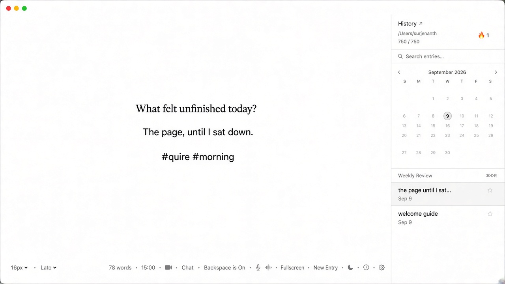
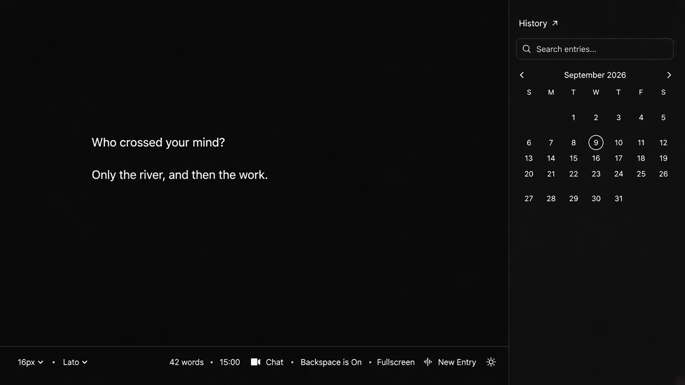
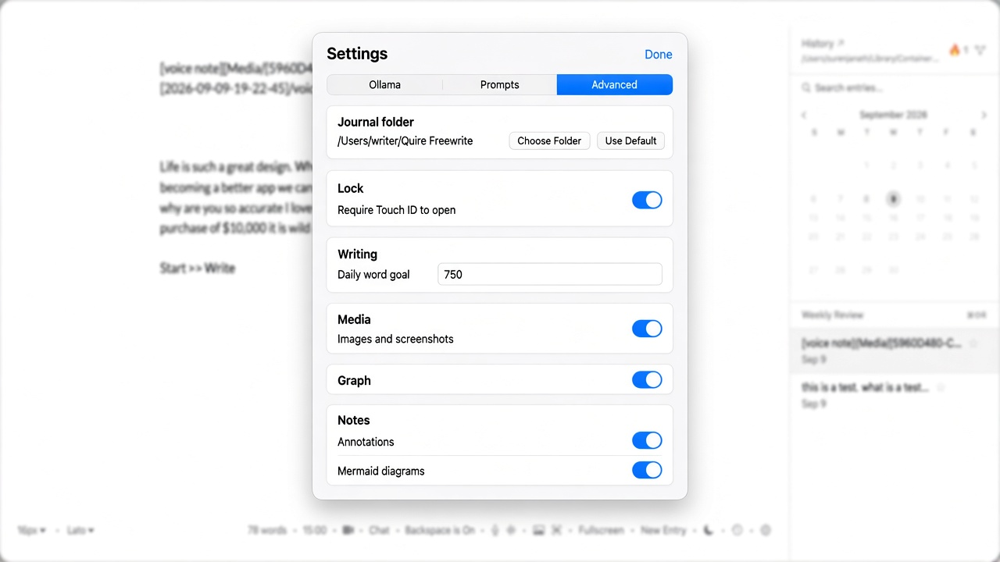
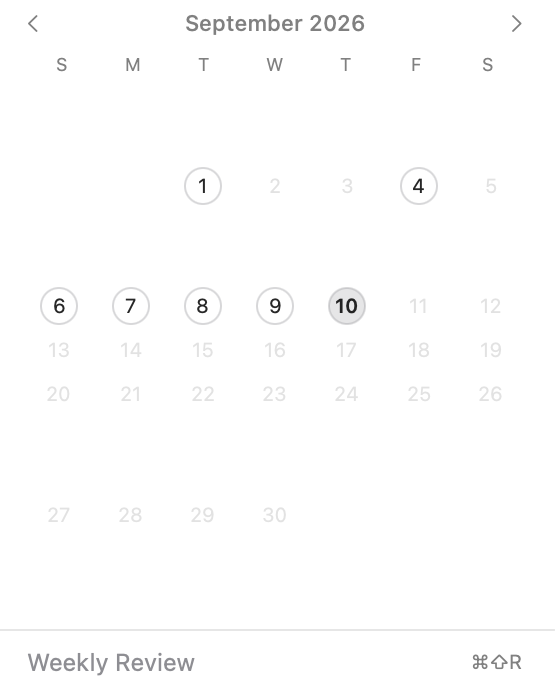
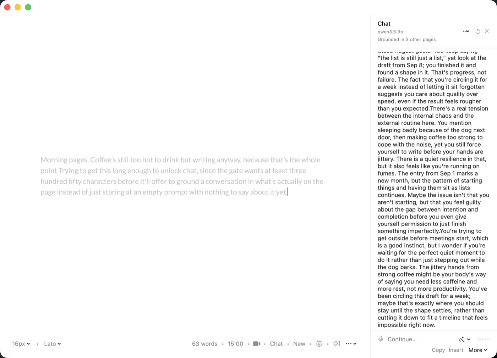
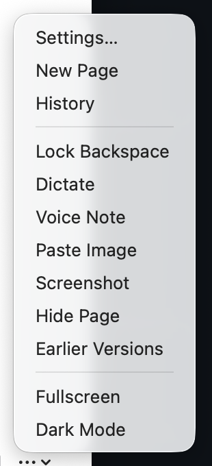

# Quire

A quiet, local-first writing room for macOS.

A blank page for stream-of-consciousness writing, with a journal, voice, video, and optional offline AI sitting behind the glass. The page stays empty until you ask for more.

**One page. Your disk. No account.**

## Look

A short tour of the page, dark mode, Settings, and the History calendar:

<video src="docs/media/tour.mp4" width="900" controls muted></video>

<p align="center">
  
</p>

| Light | Dark |
|---|---|
|  |  |

<p align="center">
  
</p>

The month heatmap and the writing bar, captured from the running app:

<p align="center">
  
</p>

<p align="center">
  
</p>

Offline chat, grounded in the journal, and the quick ⋯ menu for dictation, voice notes, and the rest:

| Chat | Quick menu |
|---|---|
|  |  |

## The idea

Write without ceremony. A timer if you want urgency. Backspace lock if you want momentum. Markdown files you can open in any editor.

Everything lives on your Mac:

```
~/Documents/Freewrite/
```

(or a folder you choose). Sandboxed builds use the app container equivalent. Entries are plain markdown with names like `[UUID]-[YYYY-MM-DD-HH-mm-ss].md`.

## What you can do

**The page**
- Timed sessions, fullscreen, light / dark (or follow the Mac)
- Optional backspace lock (IME-safe — Delete still works while composing Japanese or Chinese)
- Auto-save, a new page each day
- Typewriter scroll (caret stays in the middle)
- Sentence focus — dim every sentence except the one under the caret (⌘⇧L)
- Soft markdown — dim `#` `**` `==` `>>` while you type (font menu or Settings → Writing)
- Optional typewriter ticks and a soft room tone (Settings → Writing, off by default)
- Find on this page (⌘F / ⌘G)
- Privacy blur (⌘⇧P)
- Deleting an entry asks first, then goes to the macOS Trash — not gone forever
- A daily writing spark on the empty page
- Yesterday’s last sentence on a blank page — click to continue
- Favorite fonts (star a face from the font menu)

**The journal**
- History with search, pins, streak, and a month calendar
- Go (⌘K) — run a command or jump to a past page by typing a word from it
- Random page (from Go)
- Earlier versions — Chat and agents snapshot the page before they change it. ⌘K → Earlier versions, or Journal → Earlier Versions. Keep the last 20.
- Journal stats — lifetime entries, words written, longest entry, best streak ever, and your most-used tag. ⌘K → Journal Stats.
- Per-page lock — lock icon in History. Touch ID to open that page. Files stay plain markdown.
- On-this-day, weekly review, session recap
- `#tags` — click a chip to find other entries
- Optional daily word goal
- Custom journal folder
- Optional Touch ID / password lock at launch (a gate, not encryption)
- PDF, Markdown, and plain-text export
- Import a text or markdown file as a new page — the way in, to match the way out
- Export the whole journal as a zip (markdown, Media, Versions — not Videos or Chats)
- Video journal — pick camera and microphone in Settings → Writing
- Voice notes (audio + live transcript)
- Editor and chat dictation

**Settings → Writing (off by default)**
- Idle fade — hide the bottom bar after eight seconds without typing
- Paste / capture images; click a thumbnail to draw on it
- `[[wiki links]]` and an entry graph
- `>>` margin notes and `==highlights==`
- Mermaid flowcharts (`graph TD` / `A[Start] --> B`)

**Chat and local agents**
- Ollama beside the page — stays on this Mac
- Grounded in this page plus related past entries
- Continue / Tighten / Ask, then compare Now vs After, then Put on page
- Highlight a passage first to talk about just that
- Undo after putting a reply on the page
- Claude Code and Codex in a side panel — you watch them write, then put the reply on the page
- Reflect / Improve / Diagram / Ask, plus follow-ups
- One shared tone for ChatGPT, Claude, Ollama, and the local agents (Settings → Chat)
- Thinking, temperature, and context for Ollama
- Weekly review of the last seven days
- Chat history saved next to the entry

The first entry you ever see is still Farza’s original freewriting guide. After that, the page is yours.

## Shortcuts

| Shortcut | Action |
|---|---|
| ⌘N | New page |
| ⌘K | Go — commands and journal search |
| ⌘F / ⌘G | Find in this page / next match |
| ⌘, | Settings |
| ⌃⌘F | Fullscreen |
| ⌘⇧P | Privacy blur |
| ⌘⇧H | History |
| ⌘⇧T | Timer |
| ⌘⇧D | Light / dark |
| ⌘⇧B | Backspace lock |
| ⌘⇧M | Dictate |
| ⌘⇧A | Voice note |
| ⌘⇧O | Ollama chat |
| ⌘⇧R | Weekly review |
| ⌘⇧L | Focus this sentence |
| ⌘⇧Y | Typewriter scroll |
| ⌘⇧E | Export as PDF |

Journal menu: Go, History, Chat, Focus This Sentence. File menu: New Page, Export as PDF.

## Settings

A panel on the page (not a Mac Settings window — that draws every letter twice).

- **Chat** — Claude Code / Codex paths, one shared tone, Ollama connection, thinking, temperature, context, system prompt
- **Writing** — journal folder, lock, appearance, idle fade, word goal, images, graph, notes, mermaid
- **About** — the room, Surenjanath, where pages live, what’s included, shortcuts

Show / hide Ollama thinking lives in the Chat ••• menu, not in Settings.

## Build

**Xcode:** open `freewrite.xcodeproj`, run the `freewrite` target (macOS 14+).

**No Xcode IDE:** Command Line Tools are enough.

```bash
./run-tests.sh        # must print PASS
./build.sh            # build/Quire.app and build/Quire.zip
./build.sh --install  # copy to /Applications/Quire.app
```

Share `build/Quire.zip`. Unzip it — you get **Quire.app** and a short install note. Drag Quire into Applications. The first time, right-click the app and choose Open (ad-hoc signature). Launching the raw binary from another app can confuse macOS privacy prompts.

Microphone, camera, and speech strings are in the bundle. The first voice note or video will ask for permission.

## Storage

| Kind | Where |
|---|---|
| Text entries | `*.md` in the journal folder |
| Images / voice | `Media/[entry-base]/` |
| Videos | `Videos/` |
| Ollama chats | `Chats/` |
| Earlier drafts | `Versions/[entry-base]/` |

Change the folder in Settings → Writing. Existing files are not moved.

## What could come next

These still fit the blank page. They are not promised — pick one if you want another slice.

**Still open**
- **Notarize** — Developer ID so others can open Quire without right-click → Open. Needs your Apple Developer account; the app cannot do this by itself.

**Skip**
- Cloud or GitHub sync
- iOS / Windows / Linux ports
- Location, weather, or step-count metadata
- Publishing to WordPress or Medium
- A settings tab for every AI vendor

## Name

The Dock name is **Quire** — a gathering of pages. The bundle id is still `app.humansongs.freewrite` so your existing files and permissions keep working.

## Heritage

Fork of [farzaa/freewrite](https://github.com/farzaa/freewrite) (MIT). Farza built the blank page, the timer, and the video journal. This tree adds the journal layer, offline chat, local agents, and the Writing tools.

## License

MIT. See `LICENSE`.
